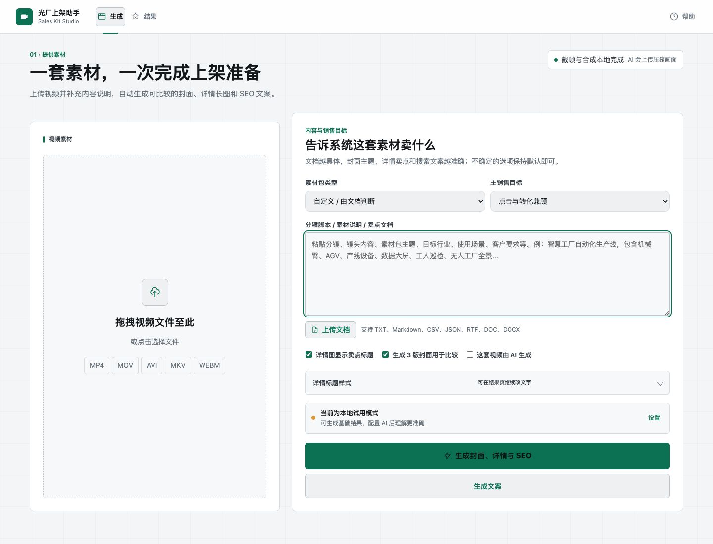
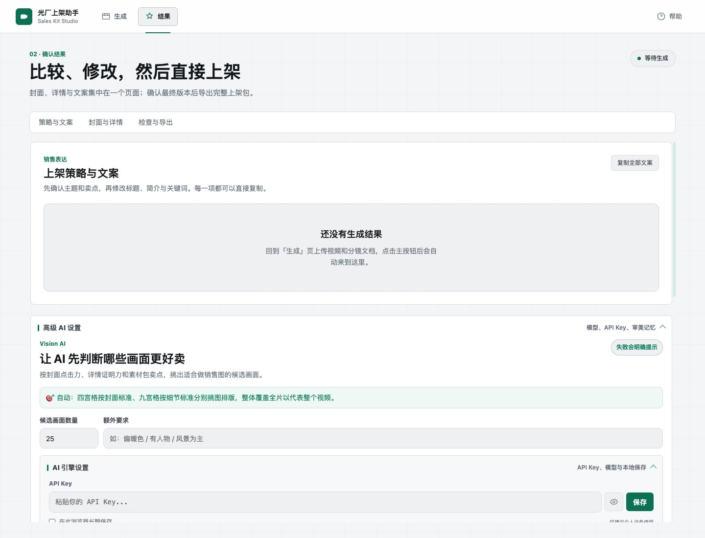
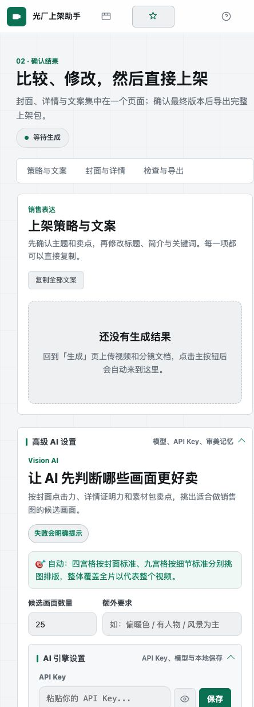
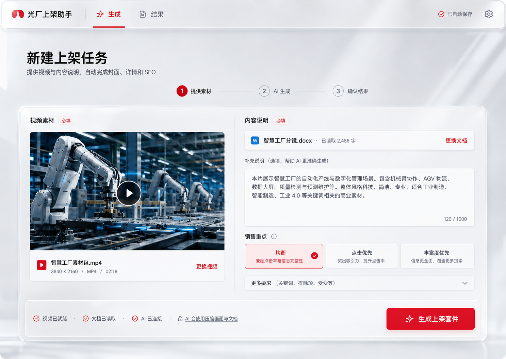
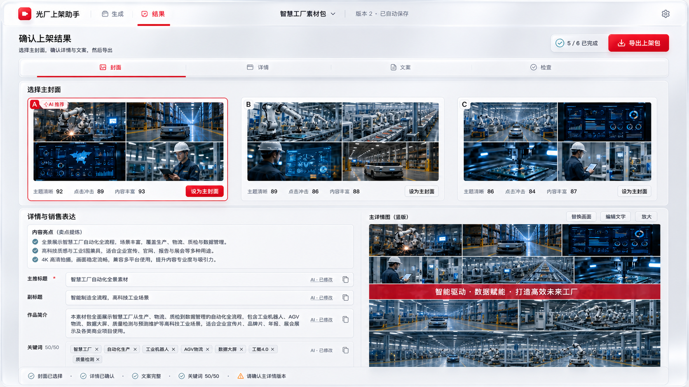
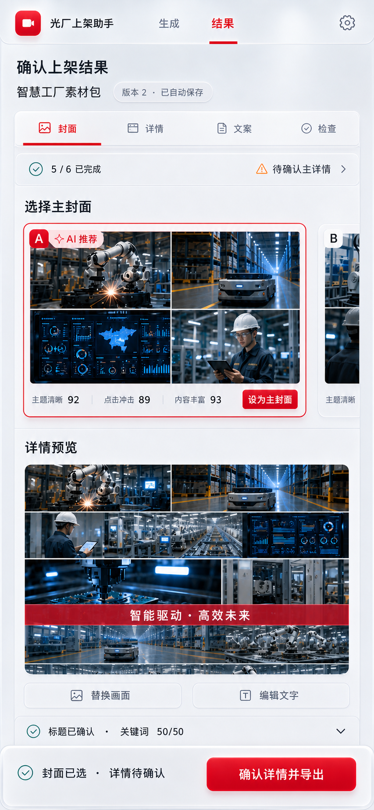

# 光厂上架助手：体验审查与重构计划

> 审查日期：2026-07-15
> 审查对象：当前本地版本 `http://localhost:5173/`
> 目标：让素材卖家用更少判断、更少设置、更少往返，完成可信、可编辑、可直接上架的一套结果。

## 1. 审查方法与边界

本轮同时从用户、产品经理、交互设计、视觉设计和可用性五个视角审查，并以真实运行页面为证据，而不是只读源码。

已验证的页面与状态：

- 桌面端生成页，1440 x 1100。
- 桌面端空结果页，1440 x 1100。
- 移动端生成页与空结果页，444 x 1234。
- 顶部导航、AI 设置、生成输入、结果锚点、检查与导出结构。
- 当前页面在 444px 宽度下没有横向溢出，这是已有实现中值得保留的基础。

本轮没有使用真实商业视频或调用第三方 AI，因此不对生成图片质量、模型耗时和真实结果数据做主观评分；相关改造以流程与界面状态设计为主。

### 现场截图








## 2. 执行结论

### 一句话判断

产品能力已经基本闭环，但界面仍把“内部实现能力”放在“用户决策”之前：用户能做很多事，却必须先理解设置、模型、选图和资产结构，才知道下一步应该做什么。

### 当前阶段的真实问题

当前不是缺少功能，而是缺少清晰的任务编排。最需要做的不是继续增加按钮，而是重新定义两张页面各自唯一的职责：

1. **新建上架任务**：只负责提供视频、内容说明并开始生成。
2. **统一结果工作台**：只负责比较、修改、确认和导出。

模型、API Key、截帧参数、审美记忆、导出规格都属于设置，不应成为主流程中的内容区块。

### 已经做对的部分

- 主导航已收敛为“生成 / 结果”，产品方向正确。
- 封面、详情、SEO 和导出已开始集中到统一结果页。
- 草稿恢复、真实规格、AI 数据边界、取消任务、失败提示和 ZIP 导出已经建立可信基础。
- 当前主视觉已从花哨渐变转向中性浅色，信息可读性提高；下一步需要用胭脂红和玻璃材质建立更鲜明的品牌识别。
- 正文字号已有明显改善，运行页面中低于 12px 的可见文本极少。
- 移动端没有横向滚动，说明响应式基础可继续沿用。

### 最关键的改造目标

- 用户第一次进入时，10 秒内知道要提供什么、会得到什么。
- 上传视频后，60 秒内无需研究设置即可开始生成。
- 结果页首屏先看到“最值得选哪一版”，而不是 AI 配置或空状态说明。
- 用户只需要做四个决策：选封面、确认详情、校正文案、导出。
- AI 失败、局部失败和本地兜底必须显式区分，不能让用户猜结果来源。

## 3. 用户视角审查

### 核心用户

**独立素材卖家**

希望用一条流程完成截图、选图、拼图和写文案。技术能力不一定强，最怕“看不懂设置”和“生成结果不可信”。

**高频运营或小型工作室**

希望连续处理多个素材包，最关心稳定、恢复、版本比较和完整导出，不愿重复配置。

**视觉复核者**

希望 AI 先做 80%，自己快速完成最后 20%。最关心图片比较、换图、文字排版、撤销和最终版本选择。

### 用户真正要完成的工作

用户并不想“调用模型、截帧、创建批次、填充格子”。用户想完成的是：

1. 告诉系统这套素材是什么。
2. 得到几版更有点击力的封面。
3. 得到能证明内容丰富、可用、值得买的详情长图。
4. 得到可直接使用的标题、简介和 50 个关键词。
5. 确认没有错误并导出完整上架包。

任何不能直接帮助这五步的内容，都应退到设置或精修模式。

## 4. 当前体验问题清单

| 优先级 | 问题 | 用户影响 | 改造建议 |
|---|---|---|---|
| P0 | 移动端先展示销售表单，视频上传区排在后面 | 用户先被要求填写，却还没有提供核心素材，顺序违背自然心智 | 调整 DOM 与响应式顺序，始终先上传视频，再补充文档与目标 |
| P0 | 生成页仍有“生成整套”和“生成文案”两个明显动作 | 用户不知道该选哪个，破坏唯一主路径 | 默认只保留“生成上架套件”；单独生成文案放入更多菜单或结果页局部重试 |
| P0 | 空结果页仍占据大面积结果容器，AI 设置展开后比结果更醒目 | 页面看起来像配置中心，不像结果工作台 | 空状态压缩为一条提示；无结果时隐藏全部高级设置和检查区，只保留返回生成 CTA |
| P0 | 结果页的信息顺序仍从文案开始 | 用户最先要判断封面点击力，视觉结果应优先 | 改为“封面决策 -> 详情确认 -> SEO 校正 -> 检查导出” |
| P0 | AI 设置仍嵌在结果正文中 | 模型、Key、审美记忆打断结果判断 | 统一移入右侧设置抽屉，页面只显示“AI 已连接 / 本地模式 / 某模块失败” |
| P0 | 结果虽在同页，但纵向堆叠较长，图片和文案仍像相邻模块而非一套商品 | 用户难以同时判断视觉表达和销售文案是否一致 | 用任务摘要串联结果；主封面、主卖点和主标题在首屏形成同一决策区 |
| P1 | 桌面生成页左侧上传区空白过大，右侧表单过密 | 同一屏同时显得空和挤，空间没有服务任务优先级 | 上传区改为稳定 16:9 媒体槽；文档和目标区减少默认项，整体合并成一个任务画布 |
| P1 | 页面顶部标题、说明、隐私条、卡片说明重复解释 | 用户阅读量大，但行动提示仍不够直接 | 标题只说任务；隐私与 AI 状态压缩成状态按钮，详细说明进入弹层 |
| P1 | 素材包类型与销售目标默认同时占据首屏 | 多数用户不知道如何选，且“类型”本可由文档推断 | 默认只显示自动识别结果；“销售重点”提供 3 个自然语言选项并允许不选 |
| P1 | 三个复选项缺少分组和优先关系 | “详情标题、三版封面、AI 生成”不是同一类设置 | 来源信息放视频元数据；输出偏好放“更多要求”，默认使用产品推荐值 |
| P1 | 详情标题样式在生成前设置，缺少真实画面上下文 | 用户无法预判文字在图片上的实际效果 | 移到结果页详情编辑器，所见即所得地修改 |
| P1 | 结果锚点导航没有当前区段反馈，且顺序与任务优先级不理想 | 长页面中容易失去位置感 | 改为吸顶进度导航，并随滚动高亮“封面 / 详情 / 文案 / 检查” |
| P1 | 导出动作不持续可见 | 用户完成修改后还要寻找导出区 | 顶部任务栏或底部操作条持续显示完成度与“导出上架包” |
| P1 | “交换画面”是全局模式，概念偏工具化 | 用户担心进入某种未知模式，移动端尤其不直观 | 桌面直接拖拽；移动端采用“点源图 -> 点目标图 -> 确认替换”，入口写“替换画面” |
| P1 | 结果来源信息分散 | 用户无法快速知道哪些是 AI、哪些是本地草稿、哪些被人工修改 | 每个模块显示统一来源标签和最后更新时间，失败可单独重试 |
| P1 | 移动端没有持续可见的主动作 | 用户滚过长表单后要寻找生成或导出按钮 | 生成页与结果页都使用底部安全区操作栏，展示唯一主动作 |
| P1 | 顶部移动导航只显示图标 | 两个相近图标不够直观，当前状态需要用户猜 | 保留短文字“生成 / 结果”，或使用清晰的两段式导航 |
| P2 | 设置里完整模型列表过长，并混合能力、价格和下线信息 | 普通用户容易选错，不知道是否支持当前任务 | 默认只展示“推荐 / 高质量 / 省成本”三档；完整模型放可搜索高级列表 |
| P2 | 状态徽标数量多，视觉权重接近正文 | 页面出现大量小块信息，影响主内容扫描 | 每区只保留一个状态，其他信息进入悬浮详情或检查面板 |
| P2 | 当前网格背景贯穿工作区 | 会弱化真实图片和表单内容的视觉层级 | 改为纯中性背景，网格只在裁剪/画布编辑器中使用 |
| P2 | 空状态只解释“还没有”，没有提供直接动作 | 用户必须自己回导航 | 提供“返回上传素材”主按钮和“恢复上次草稿”次动作 |
| P2 | 缺少首次成功示例 | 新用户不知道最终输出品质和结构 | 上传区旁提供一个低权重“查看示例结果”，打开只读示例工作台 |
| P2 | 缺少高频批量入口 | 工作室用户需要逐个重复操作 | 第二阶段增加任务队列和上架包历史，不放入新用户首屏 |

## 5. 目标信息架构

```text
光厂上架助手
├── 新建上架任务
│   ├── 上传视频
│   ├── 导入或粘贴内容说明
│   ├── 可选销售重点
│   ├── AI / 本地模式状态
│   └── 生成上架套件
├── 统一结果工作台
│   ├── 封面决策
│   ├── 详情确认与精修
│   ├── SEO 文案校正
│   ├── 上架检查
│   └── 导出完整上架包
└── 设置抽屉
    ├── API Key 与连接测试
    ├── 推荐模型档位 / 全部模型
    ├── 视频分析参数
    ├── 审美记忆
    └── 默认导出规格
```

不再保留独立 AI 页面、独立资产页面和独立导出页面。它们的能力分别进入“设置抽屉”“统一结果工作台”和“导出流程”。

## 6. 新页面方案

### 页面 A：新建上架任务

#### 页面目标

让用户在不理解任何模型或截帧术语的情况下完成输入并开始生成。

#### 桌面布局

- 顶部：产品名、生成/结果导航、当前草稿状态、设置。
- 标题区：一句任务标题和一句结果承诺，不再重复功能说明。
- 主工作区：一个宽阔的无嵌套工作面，左侧是 16:9 视频槽，右侧是内容说明。
- 视频上传后，上传槽立即变成视频预览 + 真实规格，不继续保留大空白。
- 文档区同时支持粘贴和上传，导入后显示文件名、字符数和解析状态。
- “系统将自动判断素材类型”为默认；销售重点只保留“点击优先 / 丰富度优先 / 均衡”三段选择。
- 更多要求默认收起，包含 AI 来源、封面数量、截帧参数等低频项。
- 底部：生成准备摘要 + 唯一主按钮。

#### 移动端布局

1. 视频上传。
2. 文档说明。
3. 销售重点。
4. 生成准备摘要。
5. 底部固定“生成上架套件”。

移动端不再把完整表单放在视频上传之前。

#### 状态设计

- **未上传**：主按钮禁用，并说明“先添加视频”。
- **仅视频**：允许生成，标记“AI 将仅根据画面推断，结果置信度较低”。
- **视频 + 文档**：显示“信息完整，可开始生成”。
- **AI 未连接**：主按钮写“生成本地草稿”，旁边提供“连接 AI 获得更准确结果”。
- **生成中**：以步骤显示“读取视频 / 理解内容 / 选择画面 / 生成文案 / 合成资产”，支持取消。
- **局部失败**：成功模块保留，失败模块可单独重试，不清空整套结果。

### 页面 B：统一结果工作台

#### 页面目标

这不是结果陈列页，而是一个有明确完成标准的上架决策页。

#### 首屏结构

- 顶部任务栏：项目名、自动保存状态、版本、完成度、导出上架包。
- 主摘要：AI 判断出的主题、核心卖点、主推标题，三者放在同一视觉区域。
- 封面对比：3 版四宫格横向并列，图片大于文字。
- 每版只显示三个决策维度：主题清晰、点击冲击、内容丰富。
- 推荐版有明确理由；用户点击“设为主封面”完成首要决策。

#### 详情区

- 左侧是详情结构导航与短卖点，右侧是大尺寸长图预览，符合用户此前要求的“详情展示在右侧”。
- 前三行固定 3 x 3，后续行 1-3 张并自适应高度；预览必须无黑边、无空洞。
- 点击任意画面进入替换；桌面支持拖拽跨封面和详情替换。
- 标题直接叠加在真实图片上编辑，限制为 1 个主标题 + 可选 1 个副标题。
- 主标题建议 6-12 个汉字，副标题不超过 18 个汉字；默认不生成大段文字。
- 字体、位置、对比蒙层和配色在预览旁调整，修改立即生效。

#### SEO 区

- 主推标题、备选标题、简介、关键词在同一区域编辑。
- 每项都有字符数、来源、复制和单项重写。
- 关键词自动去重、计数并标记低相关词。
- 文案修改后显示“已自动保存”，不再让用户担心丢失。

#### 检查与导出

- 检查项只显示阻断问题和可修复警告，不用六个同权重小卡片占据空间。
- 点击问题直接滚动并聚焦到对应字段或资产。
- 选择主封面、主详情且文案完整后，导出按钮进入可用状态。
- ZIP 包含封面、详情、`listing.txt`、`listing.json` 和生成摘要。

### 设置抽屉

设置从页面正文移除，通过顶部齿轮进入右侧抽屉：

- 首屏只展示 AI 连接状态和三个模型档位：推荐、高质量、省成本。
- “全部模型”必须二次展开，并提供搜索、能力标签和可用性测试。
- API Key 默认仅会话保存，长期保存需要主动勾选。
- 视频分析参数、审美记忆和导出规格分别作为二级折叠区。
- 设置关闭后不改变用户在当前任务中的滚动位置。

## 7. 关键交互规范

### 单一主动作

- 生成页唯一主动作：`生成上架套件`。
- 结果页唯一主动作：`导出上架包`。
- `重新生成`、`只重写文案`、`更换模型`都作为上下文次动作，不与主按钮竞争。

### 渐进披露

- 默认只展示完成任务必须的信息。
- 高级能力按“更多要求 -> 设置抽屉 -> 专业模式”三级展开。
- 用户已设置过的高级选项，在主页面只显示摘要，不重复展示完整控件。

### 错误与降级

- AI 调用失败时使用明确红色状态：失败模块、失败原因、重试动作。
- 本地兜底结果统一标记为“本地草稿”，不能伪装成 AI 成功结果。
- 允许封面成功、SEO 失败等部分成功状态；任何模块重试都不得覆盖其他人工修改。

### 图片替换

- 桌面：直接拖拽，目标位置出现清晰插入态；放下前显示将交换的两张图。
- 移动端：先点源图，再点目标图，底部确认条显示缩略图和“交换 / 取消”。
- 所有换图、裁剪、文字修改均进入统一撤销历史。

### 版本与恢复

- 重新生成默认创建新版本，不覆盖当前版本。
- 顶部显示 `版本 2 · 已自动保存`。
- 用户可比较版本并恢复上一版；最终导出只使用被选定的版本。

## 8. 视觉方向：赤曜玻璃 Crimson Glass

产品应像一个高端、精密的创意工作台，而不是普通企业后台。视觉参考 Apple 对层级、透明材质、留白和动效的控制方式，但保留“光厂上架助手”自己的红色品牌识别，不复制系统界面或品牌资产。

### 视觉原则

- 云雾银灰背景、半透明白色工作面、炭黑文字、胭脂红作为品牌强调色，并用少量冷银和青绿色状态色避免页面被单一红色淹没。
- 去掉全页面网格背景；网格仅在裁剪或对齐画布中使用。
- 圆角统一为 8px / 12px / 16px。小控件保持紧凑，毛玻璃容器可以略大，但不使用大量胶囊按钮。
- 玻璃质感依靠真实半透明、背景模糊、饱和度提升、1px 内高光与低对比阴影共同形成，不能只把白色透明度调低。
- 毛玻璃主要用于顶部导航、吸顶任务栏、设置抽屉、底部操作栏和少量关键工作面；图片画布与文本编辑区保持更实的白色，保证可读性和色彩判断。
- 背景可以有来自视频画面的极弱综合色彩反射，但不添加装饰性光球、彩色斑点或大面积渐变。
- 图片是结果页的第一视觉元素，封面缩略图必须明显大于评分与标签。
- 页面最大内容宽度约 1360px；大屏增加留白，不把控件拉得过宽。
- 标题 32-36px，区块标题 20-24px，正文 14-16px，辅助文字不低于 12px。
- 每个区块最多一个红色强调按钮，其他动作使用图标、玻璃次按钮或低权重文字按钮。
- 品牌红表示“主动作、已选择、当前导航”；错误状态使用更深的暗红并配合图标与文字，不能只靠颜色区分。
- 成功状态使用冷青绿，警告使用琥珀色，让状态语义不与品牌红混淆。

### 玻璃材质分级

| 层级 | 用途 | 建议参数 |
|---|---|---|
| G1 轻玻璃 | 顶部导航、锚点导航 | 白色 68%-76%，`backdrop-filter: blur(20px) saturate(150%)`，1px 半透明白边 |
| G2 工作玻璃 | 主任务画布、封面候选容器 | 白色 78%-86%，`blur(28px) saturate(135%)`，极轻阴影 |
| G3 浮层玻璃 | 设置抽屉、编辑浮层、底部操作栏 | 白色 82%-90%，`blur(36px) saturate(160%)`，内高光 + 外阴影 |
| 实色面 | 图片编辑、长文本、数据校验 | 近白实色，避免背景穿透影响阅读和图片判断 |

### 动效原则

- 页面切换使用 180-240ms 的淡入与轻微位移，不使用弹跳。
- 玻璃导航滚动时只改变模糊度和描边，不改变整体高度，避免布局抖动。
- 封面选中使用红色描边、轻微高光和勾选状态，不缩放卡片。
- 设置抽屉从右侧平滑进入；背景只降低亮度，不做强模糊叠加。
- 所有动效遵守 `prefers-reduced-motion`。

### 推荐色彩

| 用途 | 色值 |
|---|---|
| 页面背景 | `#F2F3F5` |
| 玻璃工作面 | `rgba(255,255,255,.78)` |
| 实色编辑面 | `#FCFCFD` |
| 主文字 | `#17181B` |
| 次文字 | `#666B73` |
| 分隔线 | `rgba(55,60,68,.14)` |
| 玻璃内高光 | `rgba(255,255,255,.72)` |
| 品牌胭脂红 | `#D7263D` |
| 深红按下态 | `#B8162E` |
| 淡红选中底 | `rgba(215,38,61,.09)` |
| 成功 | `#14836B` |
| 警告 | `#B56B16` |
| 错误 | `#9F1D2F` |

### 组件外观

- 主按钮：胭脂红实色或高饱和红色玻璃，白色文字，避免红色渐变。
- 次按钮：半透明白底、细灰边、轻模糊；悬停时边框变红，背景不大幅变色。
- 输入框：实色近白底，聚焦时出现 2px 淡红外环，不使用发光霓虹。
- 选中封面：红色 2px 描边 + 左上角“主封面”标签；未选版本保持银灰边。
- 状态标签：尽量使用图标 + 文本，不把所有标签都做成彩色胶囊。
- 设置抽屉：G3 毛玻璃材质，推荐档位优先，完整模型列表二次展开。

### 前端材质实现规范

- 建立统一 token：`--brand-red`、`--glass-bg-1/2/3`、`--glass-border`、`--glass-highlight`、`--glass-shadow`，不在组件中零散写透明度。
- 玻璃层同时使用 `backdrop-filter` 与 `-webkit-backdrop-filter`，并提供接近实色的降级背景；浏览器不支持模糊时仍必须清晰可读。
- 同一视口内的大面积实时模糊层不超过 4 个。移动端将模糊半径降低到 16-22px，长列表本体不做持续模糊，保证滚动性能。
- 玻璃之下必须有真实层级或内容变化才能体现材质；纯白背景上的透明白卡没有意义，应改用实色面。
- 文本输入、SEO 长文、关键词和图片色彩判断区域保持 92% 以上不透明度。
- 品牌红在单屏中的视觉面积建议不超过 10%-12%，主要用于当前状态和主动作，避免红色疲劳。
- 高光、描边和阴影都必须克制：高光不超过 1px，阴影透明度不超过 12%，不使用霓虹外发光。

## 9. 改造优先级与实施计划

### P0：结构重构，3-5 个工作日

1. 调整移动端内容顺序，视频永远在文档与设置之前。
2. 生成页移除第二主按钮，合并为一个任务画布。
3. 结果页改为封面优先，并彻底移除正文中的 AI 设置。
4. 新增统一设置抽屉。
5. 空结果页压缩并提供直接返回动作。
6. 增加顶部/底部持续可见主动作与自动保存状态。
7. 建立胭脂红品牌 token 和 G1/G2/G3 玻璃材质组件，移除旧的多主题视觉分叉。
8. 重做导航、任务画布、设置抽屉和移动端底栏的玻璃层级，并提供不支持模糊时的实色降级。

### P1：结果决策与精修，5-8 个工作日

1. 三版封面大图横向比较与最终选择。
2. 详情右侧大预览、结构导航和所见即所得标题编辑。
3. SEO 单项重写、来源标识、字符校验、关键词清洗。
4. 模块级失败重试与部分成功状态。
5. 统一拖拽、触摸替换、撤销和版本历史。
6. 检查问题可点击定位，导出状态与最终选择联动。
7. 完成材质性能与可访问性验收：滚动流畅、文字对比合格、减少动态效果有效。

### P2：效率与规模化，5-10 个工作日

1. 示例任务与首次引导。
2. 任务队列、历史上架包和批量处理。
3. 模型档位、可用性测试和成本提示。
4. 核心事件埋点：上传、开始生成、模块失败、选定版本、导出完成。
5. 将单文件页面逐步拆分为输入、生成、结果、编辑和导出模块，降低后续改版风险。

## 10. 页面验收标准

### 生成页

- 360px、768px、1440px 下无横向溢出。
- 首个可操作内容始终是视频上传。
- 默认可见设置不超过 5 项。
- 页面只有一个胭脂红主按钮。
- 无视频时，主按钮说明缺少什么；有视频时不要求用户配置模型。
- AI 模式、本地模式和数据上传边界一眼可辨。

### 结果页

- 首屏可见至少两版完整封面，并能直接设为主封面。
- AI 设置不出现在页面正文。
- 详情预览位于编辑控件右侧；手机端改为预览在前、控件在后。
- 用户可以在不离开结果页的情况下完成换图、改文字、改 SEO、检查和导出。
- 任何 AI 失败都不能无提示地展示为正常结果。
- 导出前必须选择最终封面和详情版本。
- 重新生成不能覆盖人工修改，除非用户明确选择替换当前版本。

### 可访问性

- 关键触控区域不小于 44 x 44px。
- 键盘可完成导航、选择封面、编辑文案、打开设置和导出。
- 焦点态清晰，状态变化进入 `aria-live`。
- 文本与背景达到 WCAG AA 对比度。
- 支持减少动态效果。
- 玻璃背景下的正文对比度不低于 4.5:1，任何状态都不能只依靠红色表达。
- 关闭 `backdrop-filter` 后，页面层级与可读性保持完整。

## 11. 预期成效与衡量方式

| 指标 | 目标 |
|---|---|
| 新用户从进入页面到开始生成 | 中位数小于 60 秒 |
| 从上传到完整导出的主动作次数 | 2 次：生成、导出 |
| 首次生成后完成主封面选择 | 大于 80% |
| 生成失败后成功恢复 | 大于 90% |
| 完整上架包导出成功率 | 大于 95% |
| 刷新后的任务恢复率 | 100% |
| 360-1440px 横向溢出 | 0 |

## 12. 最终设计效果图

以下三张效果图采用同一套“赤曜玻璃 Crimson Glass”方向，分别覆盖新建任务、统一结果工作台和移动端结果确认。

### 效果图 1：新建上架任务



### 效果图 2：统一结果工作台



### 效果图 3：移动端结果确认



这些效果图用于确认信息架构、页面气质和关键交互优先级，不代表最终像素稿；进入实施后应使用真实组件、真实生成资产和实际响应式断点进行二次视觉验收。
